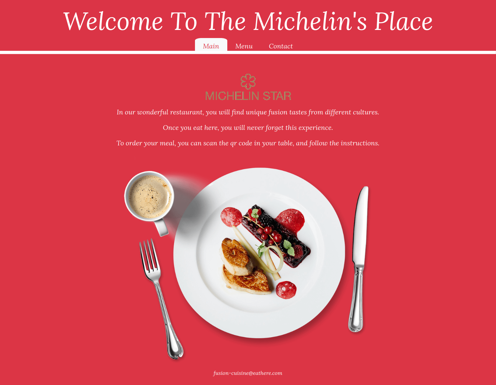

# Restaurant Page

> This is a website, built only by using Javascript. Every single html element is rendered by a Javascript code in this page..
> I also used a mini library of my own to help creating HTML elements. "src/myLib.js"

## Live Demo

[Live Demo Link](https://raw.githack.com/kubilaycaglayan/Restaurant-Page/restaurant/dist/index.html)

## Built With

- HTML
- CSS
- JAVASCRIPT
- WEBPACK
- BOOTSTRAP
- SASS

## Getting Started

### Usage

- Click the Live Demo link and enjoy with the website.

### Prerequisites

- A modern browser, up to date.

### Run tests

- There is no automated tests for this project.

## Author

👤 **Kubilay Caglayan**

- Website: [kubilay](https://kubilaycaglayan.com)
- Github: [@kubilaycaglayan](https://github.com/kubilaycaglayan)
- Twitter: [@kbcaglayan](https://twitter.com/kbcaglayan)
- Linkedin: [linkedin](https://linkedin.com/in/kubilaycaglayan)

## 🤝 Contributing

Contributions, issues and feature requests are welcome!

Feel free to check the [issues page](https://github.com/kubilaycaglayan/Restaurant-Page/issues).

## Show your support

Give a ⭐️ if you like this project!

## Acknowledgments

- https://www.theodinproject.com/courses/javascript/lessons/restaurant-page

## 📝 License

This project is [MIT](LICENSE) licensed.
